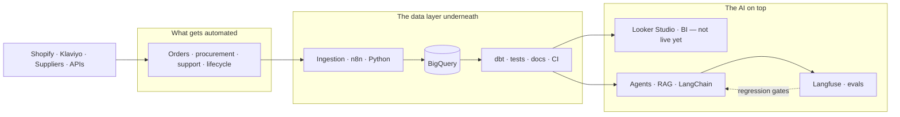

### Haris Zafar Bhatti

**Eight years running e-commerce operations. Now I automate them.**

Inventory floors, storefronts, ad accounts, supplier calls — I did that work before I built systems to do it. So when I automate a procurement flow or a support assistant, I already know where it breaks, because I used to be the person it broke on.

Currently the sole engineer on the automation, AI, and data stack at a Doha commerce operation: ~1,400 workflow executions a week at under one failure a fortnight, order handling down from 11 minutes to 40 seconds, weekly reporting from four hours to under fifteen, and a customer-facing assistant resolving 61% of conversations with no human handoff.

The hard part isn't building it. It's building it so it doesn't quietly break.

Current architecture — everything below is running except the Looker Studio ops dashboard.

#### Shipped

- dbt transformation layer on BigQuery with tests, docs, and CI
- Langfuse eval harness with a versioned eval set and LLM-as-judge regression gates

#### Building next

- n8n execution metrics into BigQuery, behind a public Looker Studio ops dashboard
- Contribution margin model, CM1 through CM4
- Server-side GTM and Meta CAPI with event_id deduplication and consent mode

#### Stack

**Commerce** — Shopify · Klaviyo · WhatsApp Business API · Amazon Seller Central

**Platform** — n8n · REST · webhooks · OAuth2 · Docker · GitHub Actions · AWS · GCP

**Data** — Python · SQL · BigQuery · dbt · Looker Studio · Postgres · Supabase

**AI** — LangChain · OpenAI · Gemini · Claude · Groq · RAG · Langfuse

#### Elsewhere

[LinkedIn](https://linkedin.com/in/hariszb)
