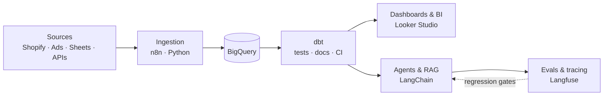

### Haris Zafar Bhatti

I build the data layer and the AI on top — ETL pipelines, warehouses, and dashboards, plus the automation and agents that run on them.

Most AI problems turn out to be data problems. Most automation projects fail because nobody modelled the data underneath. I do both halves.

Currently the sole engineer on a Doha commerce operation: ~1,400 workflow executions a week at under one failure a fortnight, order handling down from 11 minutes to 40 seconds, and a customer-facing assistant resolving 61% of conversations with no human handoff.

#### Building next

- n8n execution metrics into BigQuery, behind a public Looker Studio ops dashboard

- dbt transformation layer with tests, docs, and CI

- Contribution margin model, CM1 through CM4

- Server-side GTM and Meta CAPI with event_id deduplication and consent mode

- Langfuse eval harness with a versioned eval set and LLM-as-judge regression gates

#### Stack

Data — Python · SQL · BigQuery · dbt · Looker Studio · Postgres · Supabase

AI — LangChain · OpenAI · Gemini · Claude · Groq · RAG · Langfuse

Platform — n8n · REST · webhooks · OAuth2 · Docker · GitHub Actions · AWS · GCP

#### Elsewhere

[Portfolio](https://hariszafar.lovable.app) · [LinkedIn](https://linkedin.com/in/hariszb)
